### Hi, I am Majid Nasiri, I have extensive knowledge about terms and concepts of Artificial Neural Networks and Deep Learning and I have professional experience in designing, implementing and training Deep Neural Networks for various tasks from scratch. I have something around 4 years’ experience in machine learning and deep learning field. Following are an overview along with short descriptions of projects that I have done in there years.
 

# Projects:
## Semantic Image Segmentation using Deep Learning/TensorFlow (M.Sc. Thesis) 
### Semantic segmentation refers to the process of linking each pixel in an image to a class label. These labels could include a person, car, flower, piece of furniture, etc., just to mention a few.

  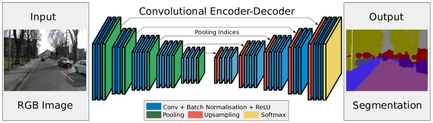

  Figure 1: FCN

 
 

## 3D Object Classification using Deep Learning/Pytorch (Australian National University)
### 3D object classification is an interesting topic especially when large scale 3D CAD datasets are available. A convolutional neural network combining spatial transformation network is used to classify 3D objects in a subset of ModelNet. We used to popular datasets ModelNet10 and ModelNet40 to train our Deep Neural Network in this work we employed Capsule Neural Network to gain classification performance. We extended our work and start new challenge named Zero-Shot Learning for 3D Points Clouds.

 

  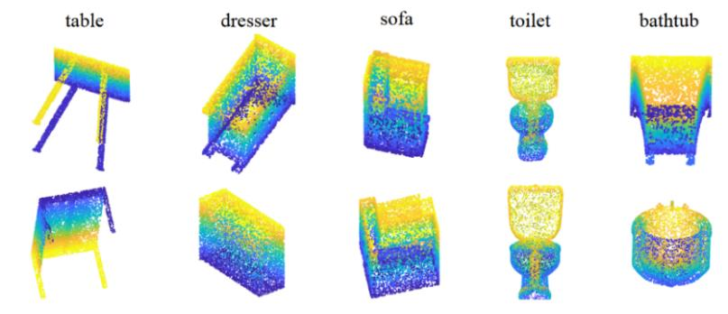

  Figure 1: ModelNet40 samples

 
 
 
 
 
 
 
 
 

## Task duration estimation based on task description using BERT model (DigiKala Company) 
### As a AI researcher i was responsible for designing implementing and training deep neural language models to extract abstract information from given task descriptions and classify to task duration span. I have used BERT as text encoder, then we extracted word relationships by stacking an LSTM cell on top of BERT word embedding, finally we used Multi-Layer Perceptronas classifier. I have implemented entire model using Pytorch framework.

 

  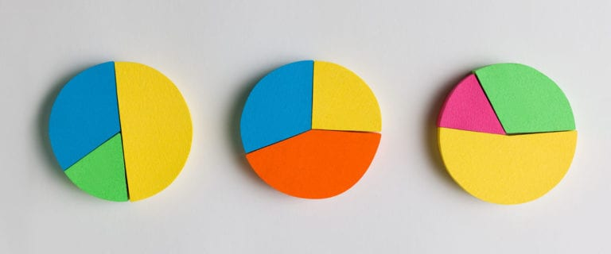

  Figure 1: Task duration estimation

 
 
 
 
 
 
 

## Concrete Defect Detection using EfficientDet/YOLOV5 model (Rahsazi Iran Company) 
### Different types of defects in concrete structures can be cracking, crazing, blistering, delamination, dusting, curling, efflorescence, scaling and spalling. These defects can be due to various reasons or causes. Detecting and localizing defects was the main goal of the project. I have adapted state-of-the-art Deep Learning based object detection models such EfficientDet and YOLOV5 model to detect defects in concretes, also i optimized these neural networks for our industry applications. I have used Pytorch framework to train models on multiple GPUs and deploy converted weights to torchscript in C++ Qt application.

 

  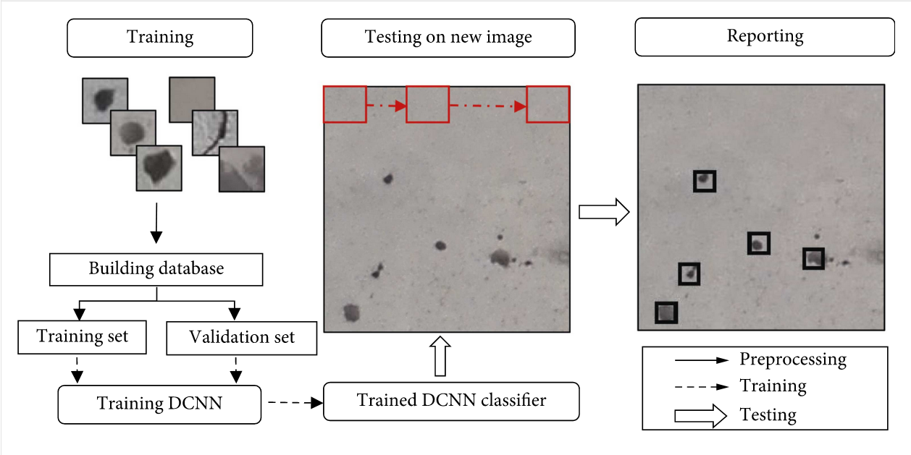

  Figure 1: Concrete Defect Detection

  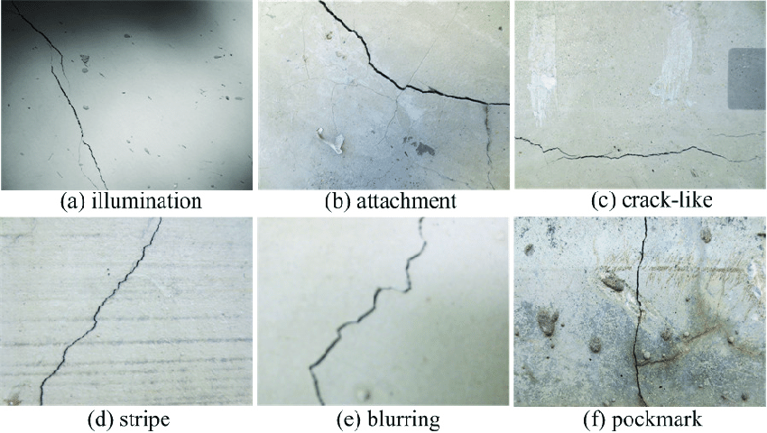

  Figure 1: Concrete Defect Detection

 
 
 
 
 
 
 
 
 

# Person Re-Identification in videos using Deep Learning/Python/TensorFlow (Freelance Project)
### Person re -identification is the task of associating images of the same person taken from different cameras or from the same camera in different occasions. In this task we used for consecutive modules named background subtraction, human detection, object tracking and re-identification modules. We used multiple constraints to improve our Video Person Re-identification.

 

  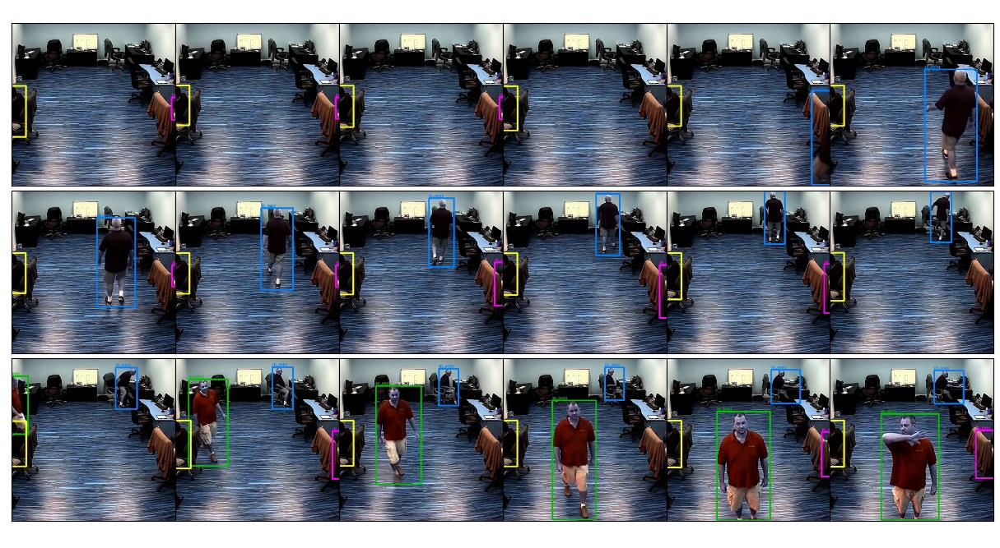

  Figure 1: Person re-identification

 
 

## Lane Detection using OpenCV/Python (Computer Vision Course)
### I completed my computer vision course by doing Lane Detection Project on Caltech Lanes Dataset. We have published a paper “Inverse perspective mapping for real time Lane Detection in City Streets” after achieving promising result in our project.
 

  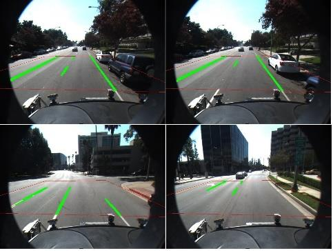

  Figure 1: Lane Detection

 
 
 
 
 
 
 

## Augmented Reality Try on (3D Face) using OpenCV (Digibina Startup)
### Virtual Try-on lets you to see what you'll look like in new glasses or sunglasses via your webcam. In this project we tackled the problem of virtual glasses try on using face landmark detection, 3d mesh fitting and mounting sub modules. We used OpenFace (open source tool) for extracting landmarks, EOS (open source tool) for fitting 3D mesh on face and different functions for mounting and texturing glasses. we have developed try-on process based on multiple micro-servicesusing FastAPI and deployed our solution on server using Docker and docker-compose technologies. We have used OpenCV, Deep Neural Networks, 3D matrix transformation, Camera Calibration and other Python packages.

 

  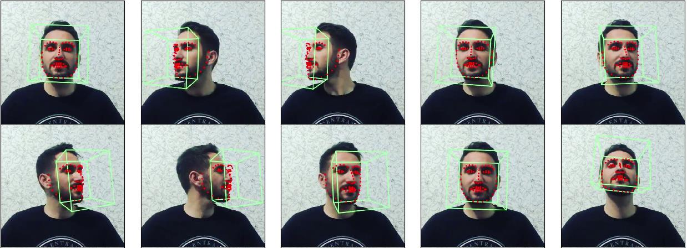

  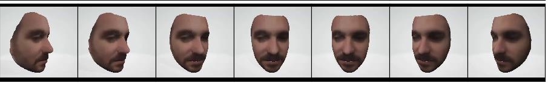

  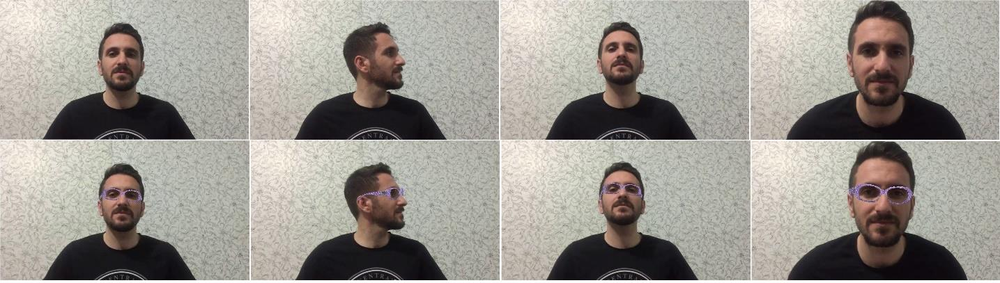

  Figure 1: Glass Try on (Augmented Reality)

 
 

## Face Spoofing Detection using TensorFlow/Pytorch/OpenCV (Tosan Techno Company) 
### For a robust face biometric system, a reliable anti-spoofing approach must be deployed to circumvent theprint and replay attacks. Due to existing many ways of face spoofing we combined multiple face spoofing methodsto detect face spoofing. face spoofing based on single image, video based, zoom action, voice action and so on.

 

<iframe src="https://drive.google.com/file/d/1_4bwwT467SEENVs_s3kH9mY9cp2L7kP_/preview" width="960" height="540" allow="autoplay"></iframe>

 
 

## Face Recognition using Deep Learning/TensorFlow/Pytorch/OpenCV (Tosan Techno Company) 
### In this project i was responsible for different part of project as follows: research face detection and verifi-cation models and adapt state-of-the-art model for attendance application, develop differentmicro-servicesusingFastAPIframework,Dockerizemicro-services,writingtestfunctionsusingPytest,mergingfacerecognitionserviceswith attendance timing services usingdocker-composeas a solution for customers.
 

  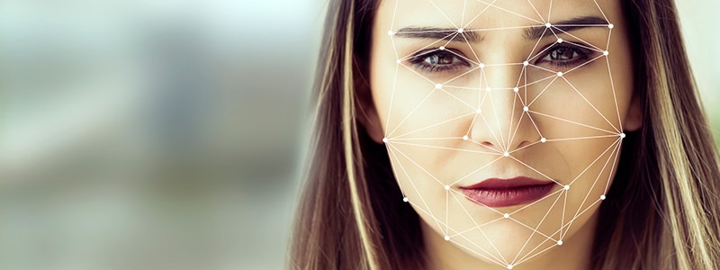

  Figure 1: Face Recognition

 
 
 
 

## Video Summarization using Deep Learning/Pytorch (Freelance Project) 
### Video summarization is one of the promising approaches for effective comprehension of video content by selecting informative frames of the video. The aim is to produce a summary of the video which is interesting to the user and representing the whole video. Following is our state-of-the-art architecture for video summarization.

 

  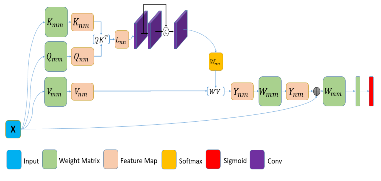

  Figure 1: Video Summarization

 

## Multi-Label Signal Classification using Deep Learning/TensorFlow (TCI) 
### For the first time we investigate the power of Deep Neural Network to classify received signal in wireless communication systems. I as a Deep System Designer with almost zero knowledge about wireless signals designed a Deep Neural Network slightly better than model based on hand crafted features by an expert. I designed and implemented various Convolutional and LSTM based architectures in different (time and frequency) domains from scratch.
 

<!-- ## Facial Expresion Recognition using Deep Learning/Pytorch (Freelance Project) 
 

  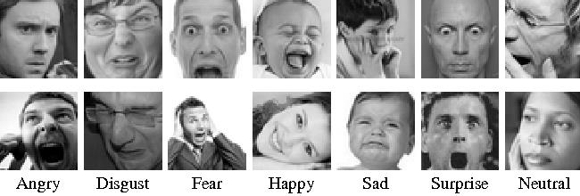

  Figure 1: Facial Expresion Recognition

  -->

## Goal and Shoot Detection in basketball using Deep Learning/TensorFlow (ePosture Startup) 
### Extracting statistics of sport players are very beneficial for coaches and players while exercising. Form the other side, deep neural networks has been successfully applied to solve various problems from big data analytics to neural language understanding and computer vision tasks. In this paper we address the problem of shoot and goal detection in basketball games with deep learning and make three main contributions. First we make an image dataset for hoop detection, second we fine-tuned Yolo-v3 deep network to detect hoop accurately. Third we present a real time method to detect shoot and goal in basketball game.

 

  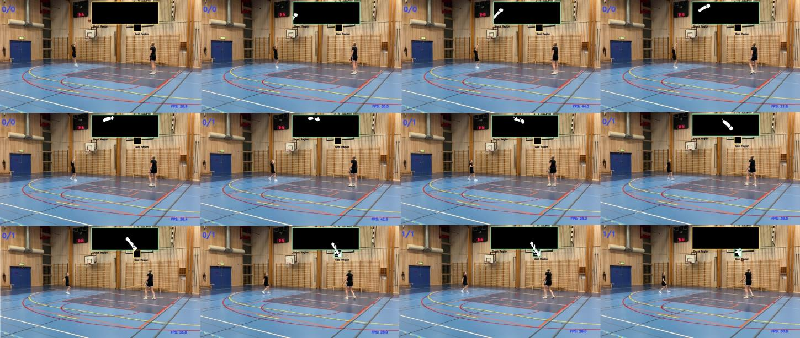

  Figure 1: Goal and Shoot Detection in basketball

